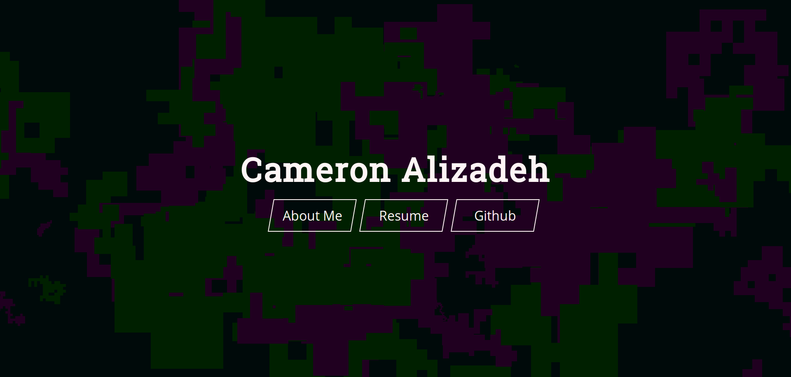
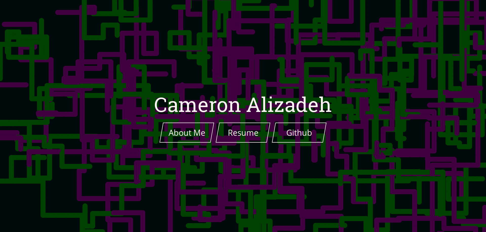
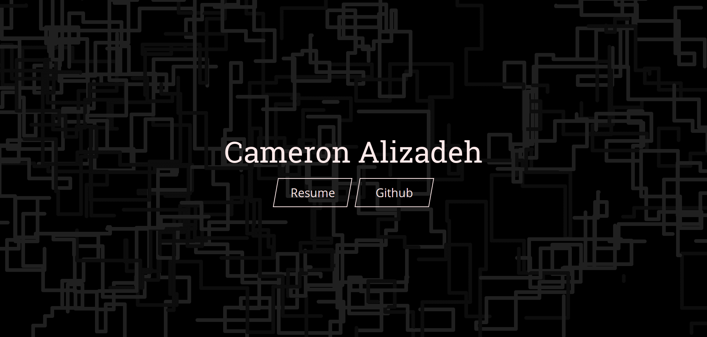

# cdalizadeh.ca

Welcome to my personal portfolio/resume page! Here you'll find an up to date, interactive version of my resume, along my best attempt at a somewhat artistic canvas animation. I'm planning to update with a proper "About Me" section and a projects portfolio soon- for now, however, please find my projects on GitHub.

The front end is built with HTML, CSS, jQuery and [williamngan's Pt.js library](https://github.com/williamngan/pt). I've built a simple Node.js backend using an Express.js static server, which was used back when the site ran on Google Cloud Platform; now, however, the site is statically hosted on GitHub Pages.

Check out the evolution of the site below:

Draft 1                          |Draft 2                            |Draft 3
:-------------------------------:|:---------------------------------:|:---------------------------------:
  |    |    

At least my design skills have improved, no?